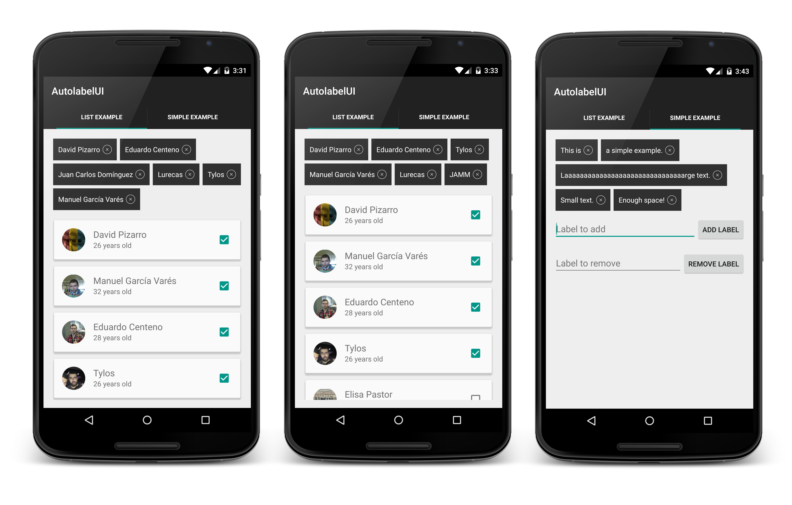
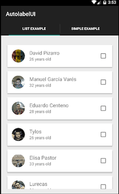

[](http://www.android-gems.com/lib/DavidPizarro/AutoLabelUI)

# AutoLabelUI [](http://android-arsenal.com/details/1/2436) [](https://maven-badges.herokuapp.com/maven-central/com.github.davidpizarro/autolabelui)

Android library to place labels next to another. If there is not enough space for the next label, it will be added in a new line.



Try out the sample application on [Google Play][1].

<a href="https://play.google.com/store/apps/details?id=com.dpizarro.libraries.autolabelui">
  
</a>

Demo
=========================



Including in Your Project
=========================

Last version is 1.0.0

Just add the following statement in your build.gradle

    compile 'com.github.davidpizarro:autolabelui:VERSION'
    
You may also add the library as an Android Library to your project. All the library files live in ```library```.

Usage
=====

To add the AutoLabelUI to your layout, add this to your xml
```xml
<com.dpizarro.autolabeluilibrary.AutoLabelUI
        android:id="@+id/label_view"
        android:layout_width="match_parent"
        android:layout_height="wrap_content"/>
```  

You can add custom attributes in your xml to customize: drawables, colors, counters, background, behaviors...
```xml

<com.dpizarro.autolabeluilibrary.AutoLabelUI
        android:id="@+id/label_view"
        android:layout_width="match_parent"
        android:layout_height="wrap_content"
        autolabel:max_labels="10"
        autolabel:show_cross="true"
        autolabel:text_color="@android:color/white"
        autolabel:text_size="@dimen/label_title_size"
        autolabel:icon_cross="@drawable/cross"
        autolabel:background_color="@color/default_background_label"
        autolabel:label_clickable="true"/>
        
```

Review [attrs.xml][3] file to know the list of shapes ready to be used in the library.


This configuration can be also provided programmatically. You can use AutoLabelUI programatically, using the Builder class to set the settings and the desired functionalities:
```java
AutoLabelUI mAutoLabel = (AutoLabelUI) view.findViewById(R.id.label_view);

AutoLabelUISettings autoLabelUISettings = new AutoLabelUISettings.Builder()
                                                                 .withMaxLabels(5)
                                                                 .withIconCross(R.drawable.cross)
                                                                 .withBackgroundColor(android.R.color.holo_blue_bright)
                                                                 .withLabelsClickables(false)
                                                                 .withShowCross(true)
                                                                 .withTextColor(android.R.color.holo_red_dark)
                                                                 .withTextSize(R.dimen.label_title_size)
                                                                 .build();

mAutoLabel.setSettings(autoLabelUISettings);
```

You can set/get values programatically:
```java
mAutoLabel.getBackgroundColor();
mAutoLabel.getTextColor();
mAutoLabel.getTextSize();
mAutoLabel.isLabelsClickables();
mAutoLabel.setTextColor(android.R.color.holo_red_dark);
mAutoLabel.setMaxLabels(5);
...
```

To know when you have reached the limit of Labels to add, you will need to implement the `onLabelsCompleted` interface:
```java
mAutoLabel.setOnLabelsCompletedListener(new AutoLabelUI.OnLabelsCompletedListener() {
    @Override
    public void onLabelsCompleted() {
        Toast.makeText(getActivity(), "Completed!", Toast.LENGTH_SHORT).show();
    }
});
```

To know when you have deleted all Labels, you will need to implement the `onLabelsEmpty` interface:
```java
mAutoLabel.setOnLabelsEmptyListener(new AutoLabelUI.OnLabelsEmptyListener() {
    @Override
    public void onLabelsEmpty() {
        Toast.makeText(getActivity(), "EMPTY!", Toast.LENGTH_SHORT).show();
    }
});
```

To know when you have deleted a Label, you will need to implement the `onRemoveLabel` interface:
```java
mAutoLabel.setOnRemoveLabelListener(new AutoLabelUI.OnRemoveLabelListener() {
    @Override
    public void onRemoveLabel(View view, int position) {
        adapter.setItemSelected(position, false);
    }
});
```

To know when you have clicked a Label, you will need to implement the `onClickLabel` interface:
```java
mAutoLabel.setOnLabelClickListener(new AutoLabelUI.OnLabelClickListener() {
    @Override
    public void onClickLabel(View v) {
        Toast.makeText(getActivity(), ((Label) v).getText() , Toast.LENGTH_SHORT).show();
    }
});
```

Or browse the [source code of the sample application][2] for a complete example of use.

Contribution
============

#### Pull requests are welcome!

I'd like to improve this library with your help!
If you've fixed a bug or have a feature you've added, just create a pull request. Issues can be reported on the github issue tracker.

Author
-------

David Pizarro (dpizarro89@gmail.com)

<a href="https://plus.google.com/u/0/110797503395500685158">
  
</a>
<a href="https://twitter.com/DavidPizarro89">
  
</a>
<a href="https://www.linkedin.com/in/davidpizarrodejesus">
  
</a>


License
-------

    Copyright 2015 David Pizarro

    Licensed under the Apache License, Version 2.0 (the "License");
    you may not use this file except in compliance with the License.
    You may obtain a copy of the License at

       http://www.apache.org/licenses/LICENSE-2.0

    Unless required by applicable law or agreed to in writing, software
    distributed under the License is distributed on an "AS IS" BASIS,
    WITHOUT WARRANTIES OR CONDITIONS OF ANY KIND, either express or implied.
    See the License for the specific language governing permissions and
    limitations under the License.
---

[1]: https://play.google.com/store/apps/details?id=com.dpizarro.libraries.autolabelui
[2]: https://github.com/DavidPizarro/AutoLabelUI/tree/master/app
[3]: https://github.com/DavidPizarro/AutoLabelUI/blob/master/library/src/main/res/values/attrs.xml
